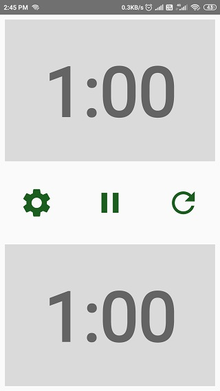
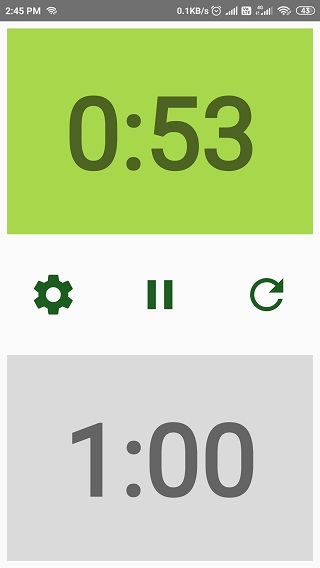
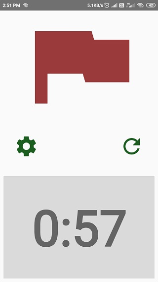
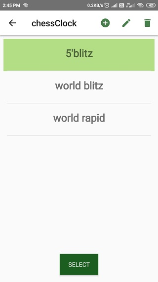
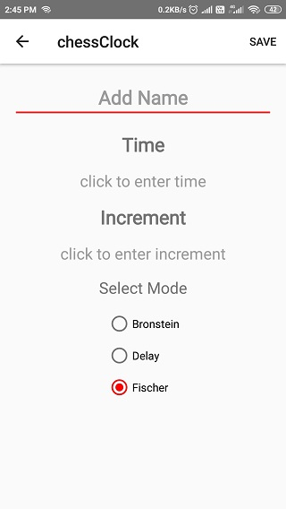
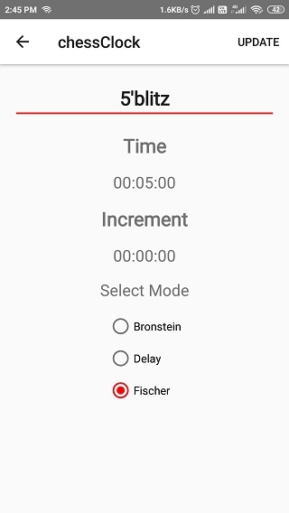

# chessClock
A chess clock app. [click here](https://github.com/MansoorCM/chessClock/blob/master/chessClock.apk) to download the apk file.

## Before the game

 The main screen shows the clock for both the players and clicking 
on one clock starts the other player's timer.

## Game in progress

when a running clock is pressed, the timer stops and the opponents time starts as shown in the screen . 

## Player lost by timeout

when one of the player runs out of time, he loses the game and the flag screen 
is shown.

## Settings page

the settings page contains some predefined time controls and allows the user
to insert new time controls using the plus icon in the menu.

## Add new Time control

the app supports the fischer,Bronstein and the Delay time mode.

## Update time control

the app also allows the user to 
update and delete the existing time controls using the edit and delete icons in the settings menu.
